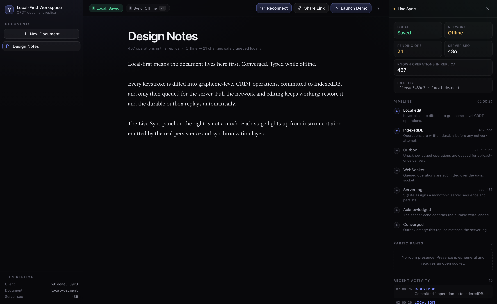
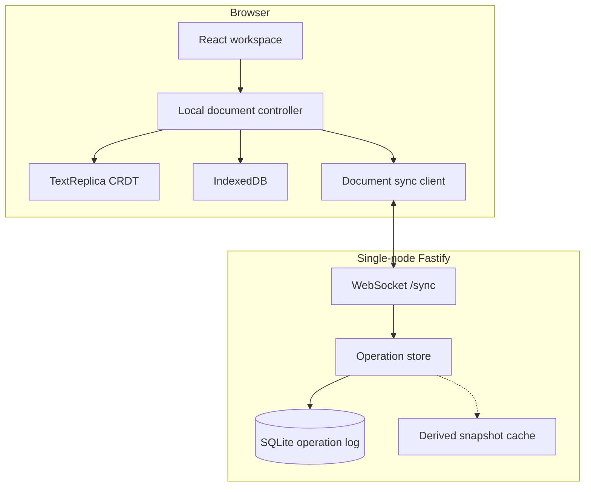
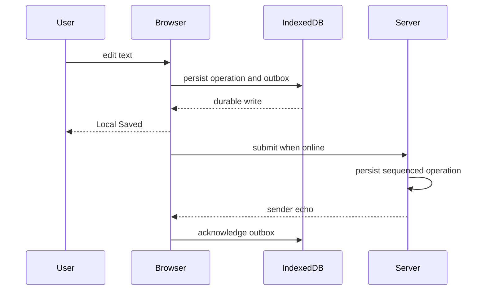
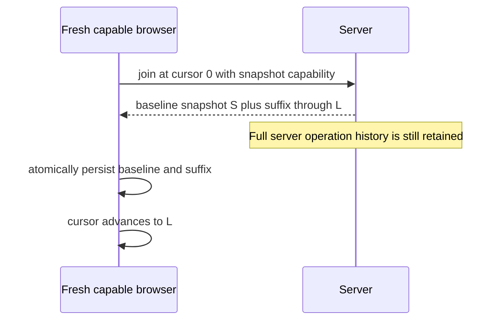

# Local-First Collaborative Document Workspace

An offline-capable collaborative plain-text workspace built around independent browser replicas, a custom CRDT, IndexedDB durability, and an explicit WebSocket/SQLite sync protocol.

[](https://github.com/simonwen7/local-first-collaborative-workspace/actions/workflows/ci.yml)


This is a local-first engineering project, not a hosted SaaS and not a Google Docs clone. The editor is the product surface. The synchronization engine is the core.

## Why local-first

Most collaborative editors treat the server as the source of truth, so losing the network means losing the document. Here the browser holds a complete, independent replica. Every keystroke is diffed into grapheme-level CRDT operations and committed to IndexedDB **before** the network is consulted. The server is a sequencing and fan-out service, not a gatekeeper.

That means editing keeps working with the backend down, edits survive a reload while still offline, and replicas converge deterministically when connectivity returns — no last-writer-wins, no lost keystrokes, no merge dialog.

## Highlights

- Custom grapheme-aware plain-text CRDT with deterministic convergence
- Local-first IndexedDB persistence: edits survive refresh without the server
- Durable offline outbox, reconnect backoff, and incremental catch-up
- Realtime WebSocket collaboration with SQLite sequencing and idempotent retries
- Multi-document workspace with shareable document URLs
- Fresh-client server snapshot bootstrap (derived cache; full server history retained)
- CRDT-anchored caret preservation so remote edits do not move your cursor
- Ephemeral room presence, never written to the operation log
- **Live Sync** inspector driven by real instrumentation from the persistence and sync layers
- Single-node operational hardening plus a zero-retry Chromium reliability gate

## Try it in one click

Press **Launch Demo** in the top toolbar. A four-step guided tour walks through the whole local-first story without DevTools, a second browser profile, or turning off Wi-Fi:

1. **Type.** The Live Sync panel lights up `LOCAL EDIT → INDEXEDDB` as operations are committed durably.
2. **Go offline.** The WebSocket is actually suspended. Keep typing: the outbox counter climbs and the header reads `Offline — N changes safely queued locally`.
3. **Reconnect.** The real outbox drains, the server sequence advances, and the pipeline finishes at **Converged**.
4. **Add a demo collaborator.** A second client with its own identity and Lamport clock joins over `/sync` and types real CRDT operations into your document.



Nothing in that panel is mocked. Each stage activates from an event emitted by the code that actually performs the work; see `apps/web/src/telemetry/sync-telemetry.ts`.

## Architecture



The SQLite operation log is the canonical server history. The snapshot cache is derived and regenerable. It does not replace, compact, or delete operations.

### Local durability before the network



### Fresh-client snapshot bootstrap

Fresh capable browsers can install a server-derived CRDT baseline plus the post-snapshot operation suffix instead of materializing every historical operation row in IndexedDB.



This is not compaction. Server snapshots remain O(history), are not used for behind or non-empty clients, and do not garbage-collect tombstones.

## 90-second manual demo (two real browsers)

The guided demo above covers this without any setup. Do it manually when you want to prove the behaviour against genuinely separate browser storage.

Use **two independent browser profiles** (or one normal window and one incognito window). Two ordinary same-origin tabs share IndexedDB and therefore **one client identity** — that is not a two-replica demo.

1. Start the server and web app (see [Quick start](#quick-start)).
2. In browser A, create a document and type.
3. Use **Share Link** and open the URL in browser B.
4. Confirm both editors converge in realtime.
5. Stop the server.
6. Keep typing in A: **Local: Saved** stays true while **Sync** disconnects.
7. Reload A while the server is still down. The offline text remains.
8. Restart the server.
9. A reconnects, flushes the outbox, and B catches up.

## Quick start

Requires **Node 24.13.0** and npm (`engines`: `>=24 <25`).

```bash
npm ci
npm run dev
```

That single command starts the Fastify sync server **and** the Vite web app. The demo needs both: a frontend without a backend looks "offline" even though nobody asked it to.

Alternatively, two terminals:

```bash
npm run dev:server
```

```bash
npm run dev:web
```

Open the printed Vite URL (typically `http://127.0.0.1:5173`). The web app connects to `ws://127.0.0.1:3001/sync` unless `VITE_SYNC_URL` is set.

```bash
npm test
npm run test:e2e:install
npm run test:e2e
```

`npm test` is Vitest only. Playwright needs Chromium installed once via `test:e2e:install`. Do not start `dev:web` / `dev:server` before `test:e2e`; that suite owns ports `4177` and `3011`.

## Reliability

Automated evidence currently:

- **Vitest:** 23 files, 182 tests, 0 skipped
- **Playwright:** 9 specs, 13 Chromium tests, `workers = 1`, `retries = 0`

Representative coverage:

- CRDT convergence and property tests
- SQLite duplicate and identity-conflict persistence
- Offline reload plus reconnect outbox flush
- Product-level offline toggle: queued operations drain on reconnect and survive a reload
- Demo collaborator: a second identity's operations converge through the real server
- Caret preservation, including mid-document typing interleaved with sender echoes
- Ephemeral presence broadcast on join and leave, scoped per document room
- Inactive-document outbox
- IME document-switch regression
- Graceful WebSocket shutdown
- SQLite schema migration
- 1100-operation snapshot-bootstrap browser regression (no fabricated prefix rows)

Source, test, and end-to-end code are all typechecked under the same strict compiler settings (`npm run typecheck` covers `src/`, `tests/`, `bench/`, and `e2e/`).

This is not complete test coverage, not formal verification, and not a Firefox/WebKit matrix.

## Benchmarks

`npm run bench` measures the in-memory CRDT work on the hot path. Median of 7 rounds after 2 warmup rounds, Apple M4 Pro, Node 24.13.0:

| Shape      |    Ops |   Apply |   Ops/sec | Materialize | Snapshot restore |
| ---------- | -----: | ------: | --------: | ----------: | ---------------: |
| sequential | 50,000 | 11.8 ms | 4,233,462 |     2.99 ms |          30.8 ms |
| concurrent | 50,000 | 11.9 ms | 4,194,895 |     4.62 ms |          41.9 ms |
| reordered  | 50,000 | 59.1 ms |   845,522 |     2.73 ms |          29.8 ms |

Out-of-order delivery is the expensive path — roughly 5x slower than in-order at 50,000 operations, because nearly every insert has to be parked in the pending-dependency buffer and drained later. No optimizations have been made against these numbers; they are a recorded baseline.

Full methodology, environment, and all history sizes: [benchmarks](docs/benchmarks.md).

## Production-shaped running

```bash
npm run build
```

- Static web output: `apps/web/dist`
- Compiled server: `apps/server/dist`

**Docker Compose starts the Fastify server only.** It does not serve the web UI. Host `apps/web/dist` separately and point the browser at the server with `VITE_SYNC_URL` or same-origin `/sync`.

See [deployment](docs/architecture/deployment.md) for environment variables, `/health` `/ready` `/metrics`, backups, and TLS/WSS assumptions.

## Repository structure

```text
apps/web          React workspace, IndexedDB replica, sync client
apps/server       Fastify WebSocket server and SQLite operation log
packages/crdt     Runtime-neutral collaborative text engine
packages/protocol Shared join/sync/operation validation
e2e               Chromium Playwright reliability gate
docs/architecture Current-state design and operations notes
```

## Limitations

- Collaboration is unauthenticated. Knowing a document id is enough to join a reachable server.
- One backend process and one SQLite database. No horizontal scaling.
- No rate limiting.
- Same-origin tabs share browser identity and local state.
- Server history is retained. Snapshot bootstrap is not compaction.
- The operator is responsible for SQLite backup. Clients cannot rebuild a lost server.
- Presence is in-memory per process and disappears on restart. Display names are unverified.
- Plain text only. No rich text, comments, or version history.
- Remote carets are not rendered. Only the local caret is preserved across remote edits.
- Benchmarks are a single unpinned laptop run, not a CI regression gate.

More operational detail: [deployment](docs/architecture/deployment.md) and [sync protocol](docs/architecture/sync-protocol.md).

## License

MIT. See [LICENSE](LICENSE).

## Deep dive

- [System overview](docs/architecture/system-overview.md)
- [CRDT design](docs/architecture/crdt-design.md)
- [Persistence model](docs/architecture/persistence-model.md)
- [Sync protocol](docs/architecture/sync-protocol.md)
- [Testing strategy](docs/architecture/testing-strategy.md)
- [Benchmarks](docs/benchmarks.md)
- [Deployment](docs/architecture/deployment.md)
- [CHANGELOG](CHANGELOG.md)
- [Architecture Decision Records](docs/decisions/)
