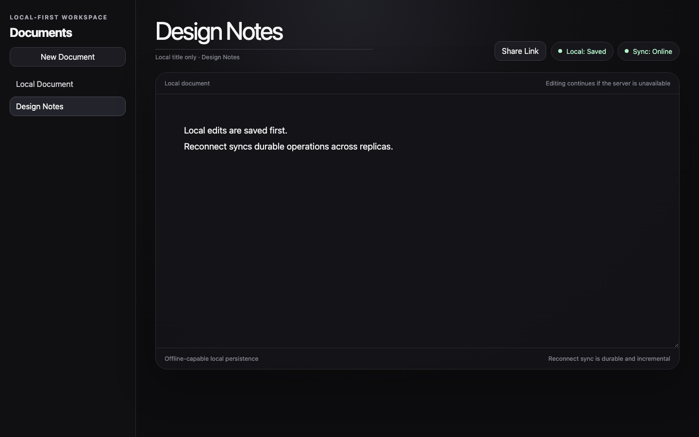
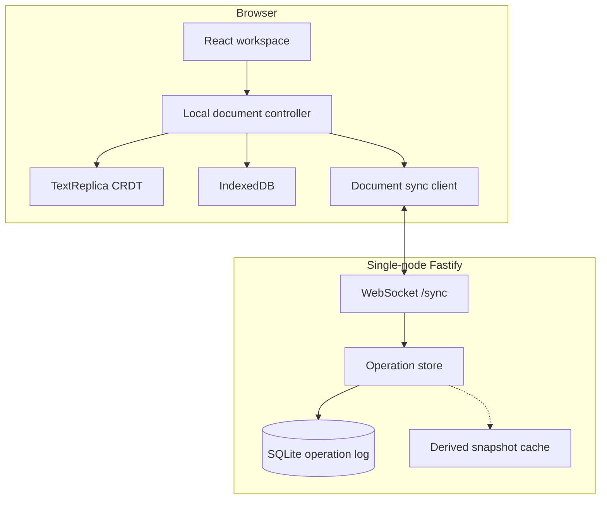
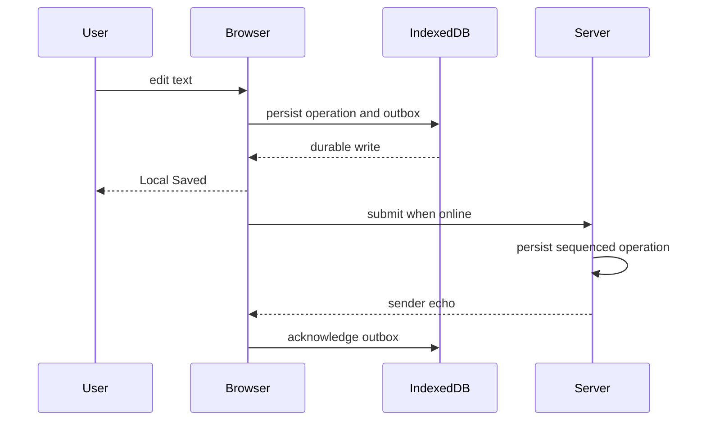
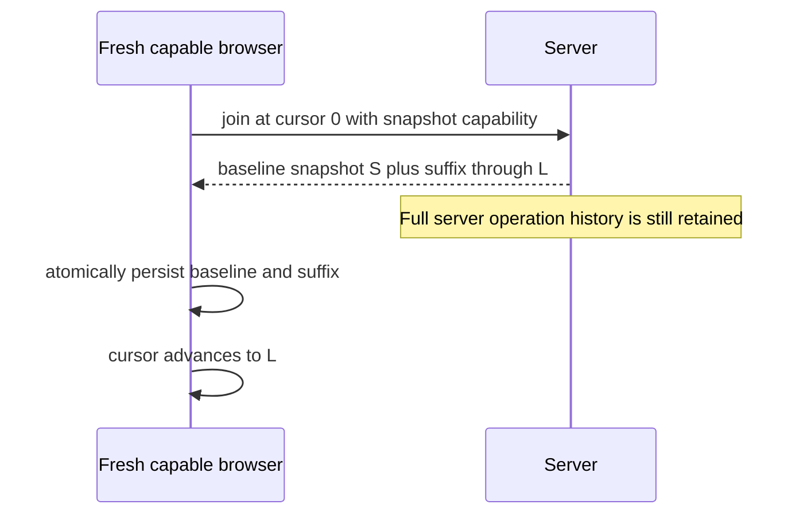

# Local-First Collaborative Document Workspace

An offline-capable collaborative plain-text workspace built around independent browser replicas, a custom CRDT, IndexedDB durability, and an explicit WebSocket/SQLite sync protocol.

[](https://github.com/simonwen7/local-first-collaborative-workspace/actions/workflows/ci.yml)



This is a local-first engineering project, not a hosted SaaS and not a Google Docs clone. The editor is the product surface. The synchronization engine is the core.

## Highlights

- Custom grapheme-aware plain-text CRDT with deterministic convergence
- Local-first IndexedDB persistence: edits survive refresh without the server
- Durable offline outbox, reconnect backoff, and incremental catch-up
- Realtime WebSocket collaboration with SQLite sequencing and idempotent retries
- Multi-document workspace with shareable document URLs
- Fresh-client server snapshot bootstrap (derived cache; full server history retained)
- Single-node operational hardening plus a zero-retry Chromium reliability gate

## Architecture



The SQLite operation log is the canonical server history. The snapshot cache is derived and regenerable. It does not replace, compact, or delete operations.

### Local durability before the network



### Fresh-client snapshot bootstrap

Fresh capable browsers can install a server-derived CRDT baseline plus the post-snapshot operation suffix instead of materializing every historical operation row in IndexedDB.



This is not compaction. Server snapshots remain O(history), are not used for behind or non-empty clients, and do not garbage-collect tombstones.

## 90-second demo

Use **two independent browser profiles** (or one normal window and one incognito window). Two ordinary same-origin tabs share IndexedDB and therefore **one client identity** — that is not a two-replica demo.

1. Start the server and web app (see [Quick start](#quick-start)).
2. In browser A, create a document and type.
3. Use **Share Link** and open the URL in browser B.
4. Confirm both editors converge in realtime.
5. Stop the server.
6. Keep typing in A: **Local: Saved** stays true while **Sync** disconnects.
7. Reload A while the server is still down. The offline text remains.
8. Restart the server.
9. A reconnects, flushes the outbox, and B catches up.

## Quick start

Requires **Node 24.13.0** and npm (`engines`: `>=24 <25`).

```bash
npm ci
```

Terminal 1:

```bash
npm run dev:server
```

Terminal 2:

```bash
npm run dev:web
```

Open the printed Vite URL (typically `http://127.0.0.1:5173`). The web app connects to `ws://127.0.0.1:3001/sync` unless `VITE_SYNC_URL` is set.

```bash
npm test
npm run test:e2e:install
npm run test:e2e
```

`npm test` is Vitest only. Playwright needs Chromium installed once via `test:e2e:install`. Do not start `dev:web` / `dev:server` before `test:e2e`; that suite owns ports `4177` and `3011`.

## Reliability

Automated evidence currently:

- **Vitest:** 20 files, 151 tests, 0 skipped
- **Playwright:** 6 specs, 7 Chromium tests, `workers = 1`, `retries = 0`

Representative coverage:

- CRDT convergence and property tests
- SQLite duplicate and identity-conflict persistence
- Offline reload plus reconnect outbox flush
- Inactive-document outbox
- IME document-switch regression
- Graceful WebSocket shutdown
- SQLite schema migration
- 1100-operation snapshot-bootstrap browser regression (no fabricated prefix rows)

This is not complete test coverage, not formal verification, and not a Firefox/WebKit matrix.

## Production-shaped running

```bash
npm run build
```

- Static web output: `apps/web/dist`
- Compiled server: `apps/server/dist`

**Docker Compose starts the Fastify server only.** It does not serve the web UI. Host `apps/web/dist` separately and point the browser at the server with `VITE_SYNC_URL` or same-origin `/sync`.

See [deployment](docs/architecture/deployment.md) for environment variables, `/health` `/ready` `/metrics`, backups, and TLS/WSS assumptions.

## Repository structure

```text
apps/web          React workspace, IndexedDB replica, sync client
apps/server       Fastify WebSocket server and SQLite operation log
packages/crdt     Runtime-neutral collaborative text engine
packages/protocol Shared join/sync/operation validation
e2e               Chromium Playwright reliability gate
docs/architecture Current-state design and operations notes
```

## Limitations

- Collaboration is unauthenticated. Knowing a document id is enough to join a reachable server.
- One backend process and one SQLite database. No horizontal scaling.
- No rate limiting.
- Same-origin tabs share browser identity and local state.
- Server history is retained. Snapshot bootstrap is not compaction.
- The operator is responsible for SQLite backup. Clients cannot rebuild a lost server.

More operational detail: [deployment](docs/architecture/deployment.md) and [sync protocol](docs/architecture/sync-protocol.md).

## License

MIT. See [LICENSE](LICENSE).

## Deep dive

- [System overview](docs/architecture/system-overview.md)
- [CRDT design](docs/architecture/crdt-design.md)
- [Persistence model](docs/architecture/persistence-model.md)
- [Sync protocol](docs/architecture/sync-protocol.md)
- [Testing strategy](docs/architecture/testing-strategy.md)
- [Deployment](docs/architecture/deployment.md)
- [CHANGELOG](CHANGELOG.md)
- [Architecture Decision Records](docs/decisions/)
